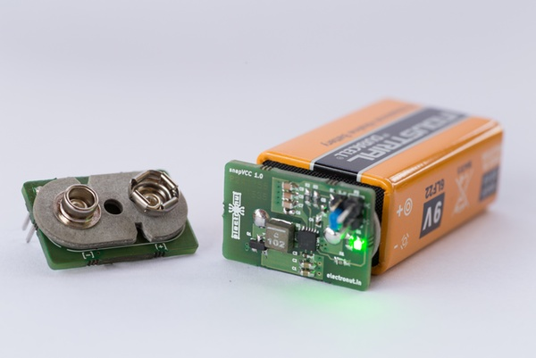

#snapVCC

# License

 snapVCC by <a xmlns:cc="http://creativecommons.org/ns#" href="http://electronut.in/" property="cc:attributionName" rel="cc:attributionURL">Mahesh Venkitachalam</a> is licensed under a <a rel="license" href="http://creativecommons.org/licenses/by/4.0/">Creative Commons Attribution 4.0 International License</a>.

## Description

**snapVCC** is a highly portable and convenient power supply for your electronics projects. 
It’s designed to snap right on to a 9 V battery and give you 3.3 V or 5 V power wherever you need it.

## Specifications

* **TI TPS560200** buck converter for efficient regulation of battery voltage.
* LED indication.
* Reverse polarity protection.
* Switch for setting output voltage to 3.3 V or 5 V
* Battery cap design, snaps on the top of battery.    
* A convenient trace cut option for the power LED to conserve battery     
* 90 degree output headers for a flat profile.

## Applications

* DIY Electronics projects.    
* Prototyping products.
* Field testing electronics due to portability.

## Electrical characteristics

| Characteristics | Values |
|---------------------|-----------------------------------|
| Input Voltage Range | 4.7 V to 17 V |
| Output Voltage Range | Switchable between 3.3 V and 5 V |
| Output current | 500 mA continuous Current |
| Reverse polarity protection | P-MOSFET |

## Dimensions: 
25.9 mm x 17.3 mm x 10.2 mm

## Version: 
2.1 

